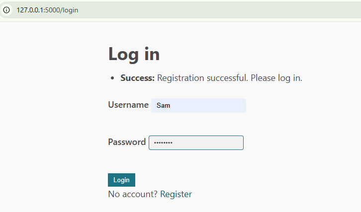
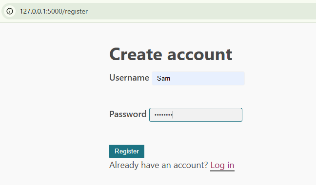

## Secure Flask Login System + Insecure Pattern Analyzer

### Setup

1. Create a virtual environment (recommended) and install dependencies:

```bash
python -m venv .venv
. .venv/Scripts/activate  # Windows PowerShell: .venv\Scripts\Activate.ps1
pip install -r requirements.txt
```

2. Configure environment (optional but recommended):

- Set `SECRET_KEY` to a strong random value (hex/base64). Example (PowerShell):

```bash
$env:SECRET_KEY = [Guid]::NewGuid().ToString("N")
```

- Enable debug only when needed:

```bash
$env:FLASK_DEBUG = "1"  # optional for local debugging
```

### Run the app

```bash
python app.py
```

- Visit `http://127.0.0.1:5000`
- Register a new account, then log in

### Security Analyzer

Scan the repository for hardcoded credentials and insecure patterns:

```bash
python security_analyzer.py
```

- Exit code is `0` if no findings, `1` if issues were detected
- Detectors include: hardcoded `username/password` checks, string-literal `password`/`secret` assignments, hardcoded `SECRET_KEY`, `debug=True`, insecure `md5/sha1`, and possible plaintext password SQL inserts

### Notes

- Passwords are stored as secure hashes via `werkzeug.security`
- SQLite DB file is `app.db` created on first run
- `SECRET_KEY` defaults to a random per-run value if not set; set it in env for stable sessions

## Screenshots

# /login 



# /Register


# /Dashboard


# 

